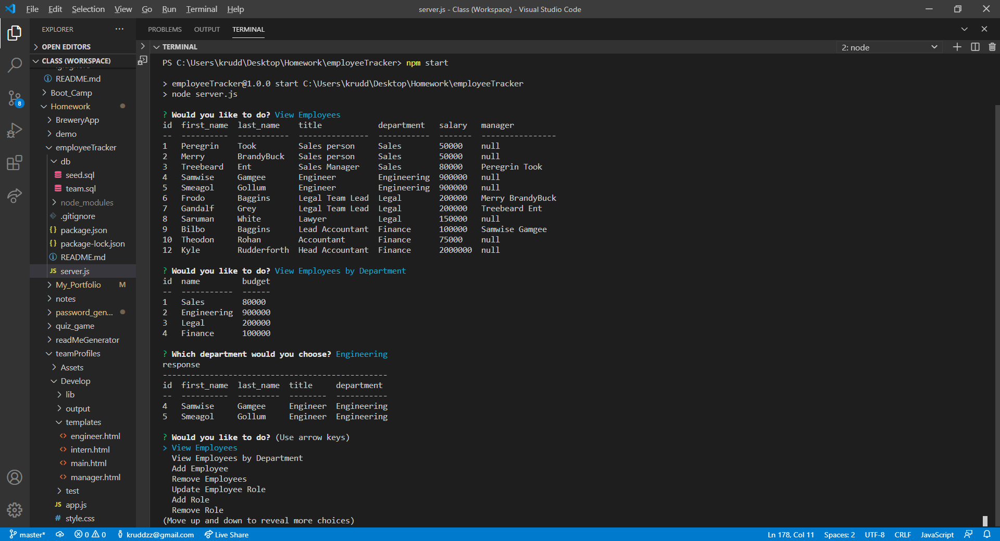

  # Project Title: Employee Tracker App

  ## Project Description:
 
  An app designed so that users can write, save and delete notes.

  ## Table of Contents
  * [Installation](#installation)
  * [Usage](#usage)
  * [License](#license)
  * [Credits](#credits)
  * [Contributors](#contributors)
  * [Test](#test)
  * [Screenshot](#screenshot)
  * [Video](#video)
  * [Questions](#questions)
  * [Badges](#badges)
  
  ## Installation:
 
  You would need to clone or fork the repo. then you woud need to run npm i, npm i inquirer , nmp i mysql and npm i console.log.

  ## Usage:
 
after everything is installed. open the employeeTracker foldeer in terminal. Then type npm start. Then you should be prompted chioces base on your answers.

  ## License:
  

  ## Credits:

  Kyle Rudderforth: https://github.com/kruddzz/employeeTracker
  
  ## Contributors:
  
  none

  ## Test:
   
  none

  ## Screenshot:

  

  ## Video

  

  ## Questions:
  
  You can reach out to me useing other my email or github profile.
  
  Email: kruddzz@gmail.com
  
  Git Hub Profile: https://github.com/kruddzz

  ## Badges:
  
  

